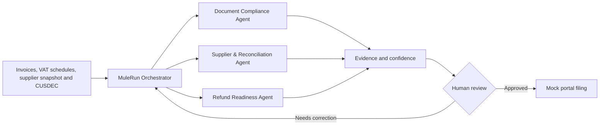

# ComplyPilot RefundShield

**VAT Refund Readiness & Evidence Autopilot for Sri Lankan exporters**

ComplyPilot helps an exporter find invoice, supplier, VAT-schedule and Customs-evidence blockers before filing. It provides an explainable refund-readiness score, a prioritised action plan, a statutory 45-day clock scenario and a complete human-reviewed audit trail.

> ComplyPilot does **not** predict the Inland Revenue Department's official Low/Medium/High risk category and does not guarantee a VAT refund date. The score is a transparent internal readiness proxy.

## Interactive UI demo

The repository currently contains a self-contained front-end prototype:

- `ComplyPilot-RefundShield-UI-Demo.html`
- No build process or package installation is required.
- All data is synthetic and all interactions run locally in the browser.

### Quick start

Option 1 - open the file directly:

1. Download or clone the repository.
2. Open `ComplyPilot-RefundShield-UI-Demo.html` in a modern browser.

Option 2 - run a local server:

```bash
python -m http.server 4173
```

Then visit:

```text
http://127.0.0.1:4173/ComplyPilot-RefundShield-UI-Demo.html
```

## Demo features

- **Explainable readiness score** - deterministic 100-point calculation with a visible component breakdown.
- **Claim Value Under Review** - shows the input VAT value connected to unresolved evidence without presenting it as a confirmed loss.
- **Three-agent workflow** - Document Compliance, Supplier & Reconciliation, and Refund Readiness.
- **Regulatory Time Machine** - compares the evidence before and after the revised invoice format becomes effective on 1 October 2026.
- **Evidence Graph** - traces a finding from its source document through the applied rule to the required human action.
- **What-if simulator** - resolves blockers and updates the score, evidence value and readiness status immediately.
- **45-day Clock Twin** - compares a normal statutory scenario with a simulated Notice 2 correction scenario.
- **Human-approved mock filing** - keeps the authorised user in control and never accesses the live IRD portal.
- **Replayable audit trail** - records agent findings, human fixes, rule-profile changes and mock filing actions.

## The problem

Sri Lanka replaced the Simplified VAT scheme with a Risk-Based Refund Scheme from 1 October 2025. Eligible registrants are categorised as Low, Medium or High risk, and the processing path depends on that categorisation. The official notice also explains that a Notice 2 issued for missing schedules or schedule errors can change when the 45-day period begins.

At the same time, a revised VAT tax-invoice format becomes effective on 1 October 2026. Exporters therefore need more than an invoice generator: they need a continuous way to connect invoice evidence, supplier information, VAT schedules and Customs records before submission.

## Product architecture



### 1. Document Compliance Agent

- Extracts invoice fields from images and PDFs.
- Returns field-level confidence and source traceability.
- Validates calculations and mandatory fields.
- Applies a versioned rules pack based on its effective date.

### 2. Supplier & Reconciliation Agent

- Checks supplier evidence and displays the source's effective date.
- Matches invoices to VAT schedules and ledger records.
- Compares export values with sample CUSDEC data.
- Produces matched/unmatched items and reconciliation explanations.

### 3. Refund Readiness Agent

- Combines verified findings from the specialist agents.
- Calculates the deterministic readiness score.
- Shows claim value linked to unresolved evidence.
- Produces the action plan and statutory clock scenario.
- Stops at the human-approval gate before mock filing.

## Transparent scoring model

The language model does not invent the score. The prototype uses a visible formula:

| Component | Maximum points |
| --- | ---: |
| Document completeness | 30 |
| Schedule reconciliation | 25 |
| Supplier evidence | 20 |
| Customs reconciliation | 15 |
| Submission package | 10 |
| **Total** | **100** |

The synthetic demo starts at `68/100`. Resolving the three evidence blockers moves the case to `89/100` and approval-ready status.

## What makes it different

The IRD Schedule File Verifier can check whether a schedule has the required structure. ComplyPilot's proposed role is different: it checks whether the schedule is supported by matching invoices, supplier evidence, ledger records and Customs data.

A schedule can therefore be structurally valid while the wider evidence package still requires reconciliation.

## Planned Alibaba Cloud implementation

| Layer | Planned component | Role |
| --- | --- | --- |
| Multimodal extraction | Qwen vision-language model through Model Studio | OCR, layout understanding, handwriting and field confidence |
| Workflow orchestration | MuleRun + Qwen reasoning model | Agent routing, evidence combination and human checkpoints |
| Rules and retrieval | AnalyticDB | Versioned regulatory clauses, rules and source-dated snapshots |
| Event processing | Function Compute | Parallel extraction and reconciliation jobs |
| Application and storage | ECS + OSS | Dashboard, API, encrypted documents and audit artifacts |

## Buildathon tools

- **Qoder** - agentic development environment used to turn the specification into implementation tasks, code, tests and documentation.
- **QoderWork** - desktop agent used to organise research, demo assets and structured team outputs.
- **MuleRun** - planned workflow runtime for agent calls, document tools, approvals and status events.

The team remains responsible for architecture decisions, regulatory interpretation, dataset design, security controls, test acceptance and final submission decisions.

## Three-minute demo flow

1. Show `LKR 4.2M` of claim value under review, readiness `68/100` and three blockers.
2. Upload synthetic invoices, a VAT schedule, supplier snapshot and sample CUSDEC file.
3. Open the Evidence Graph and explain why the structurally valid schedule is not yet evidence-ready.
4. Switch the Regulatory Time Machine to the 1 October 2026 rule profile.
5. Resolve the three blockers and show the score move from `68` to `89`.
6. Compare the standard 45-day scenario with a simulated Notice 2 scenario.
7. Complete the human-approved mock filing and replay the audit trail.

## MVP boundaries

Included in the prototype:

- Synthetic data only
- Explainable readiness model
- Versioned rule-profile demonstration
- Evidence graph and blocker workflow
- Human-reviewed mock submission
- Local audit-log export

Deliberately excluded:

- Live IRD filing
- Real taxpayer credentials or taxpayer data
- Unattended filing
- A claim to reproduce the IRD's official model
- A guarantee of a payment or refund date

## Roadmap

1. Connect the UI to a Qwen-powered document-extraction service.
2. Implement MuleRun orchestration and durable workflow state.
3. Build a professionally reviewed, versioned Sri Lankan VAT rules pack.
4. Add structured VAT-schedule, ledger and CUSDEC parsers.
5. Evaluate field-level extraction accuracy on a held-out synthetic dataset.
6. Pilot with authorised finance and tax professionals before handling production data.

## Primary references

- [IRD Notice PN/SVAT/2025-01 - Abolition of SVAT and introduction of RBRS](https://www.ird.gov.lk/en/Lists/Latest%20News%20%20Notices/Attachments/718/PN_SVAT_2025-01_22092025_E.pdf)
- [IRD Circular SEC/2025/E/06 - Risk-Based Refund Scheme](https://www.ird.gov.lk/en/publications/Circulars_Circulars/SEC_2025_E_06_E.pdf)
- [Gazette Extraordinary No. 2500/106 - invoice-format effective-date amendment](https://www.ird.gov.lk/en/publications/Gazette_Documents/2026_2500_106_E.pdf)
- [IRD Inactive VAT List](https://www.ird.gov.lk/en/publications/SitePages/Inactive%20VAT%20List.aspx?menuid=1411)
- [IRD Schedule File Verifier tools](https://www.ird.gov.lk/en/Downloads/SitePages/Tools.aspx)

## Disclaimer

ComplyPilot is a hackathon prototype and decision-support concept. It is not tax, accounting or legal advice. Production use requires current-law verification, authorised data access, security review and qualified professional advice.

---

Built by **Team Odin** for the AI Buildathon.
