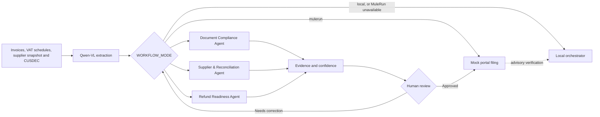

# ComplyPilot RefundShield

**VAT Refund Readiness & Evidence Autopilot for Sri Lankan exporters**

ComplyPilot helps an exporter find invoice, supplier, VAT-schedule and Customs-evidence blockers before filing. It provides an explainable refund-readiness score, a prioritised action plan, a statutory 45-day clock scenario and a complete human-reviewed audit trail.

> ComplyPilot does **not** predict the Inland Revenue Department's official Low/Medium/High risk category and does not guarantee a VAT refund date. The score is a transparent internal readiness proxy.

## Run the application

The working application is a Next.js App Router project. Requires Node.js 20 or later.

```bash
npm install
cp .env.example .env.local   # then add your Model Studio key
npm run dev                  # http://localhost:3000
```

Production build:

```bash
npm run build
npm start
```

### Run with Docker Compose

Docker Compose runs the production standalone build and includes the Chromium
runtime required by the Playwright GUI filing agent.

```bash
# Optional: create .env for live Qwen or MuleRun credentials.
# The app also runs honestly in demo/local mode without these values.
cp .env.example .env

docker compose up --build
# open http://localhost:3000
```

Stop the application with `docker compose down`. Set `APP_PORT=8080` in `.env`
if port 3000 is already occupied. Keep `GUI_AGENT_HEADLESS=true` inside Docker;
run the app directly on the host if you need a visible Playwright browser window.
The Compose service passes secrets at runtime and does not bake them into the
image.

`ComplyPilot-RefundShield-UI-Demo.html` remains in the repository as the original
static visual reference. [`DEVELOPMENT_AGENT_BRIEF.md`](DEVELOPMENT_AGENT_BRIEF.md)
holds the implementation contract, API shape and acceptance checklist.

### Environment variables

Copy [`.env.example`](.env.example) to `.env.local`. Never commit a populated env file.

| Variable | Purpose |
| --- | --- |
| `APP_PORT` | Host port exposed by Docker Compose; defaults to `3000`. |
| `DASHSCOPE_API_KEY` | Model Studio API key. Read server-side only. |
| `DASHSCOPE_BASE_URL` | OpenAI-compatible endpoint. Differs by region. |
| `QWEN_MODEL` | Vision-language model id used for invoice extraction. |
| `QWEN_CHAT_MODEL` | Text model used by the grounded Data Copilot. |
| `GUI_AGENT_HEADLESS` | Keep `true` in Docker; use `false` for a visible host browser. |
| `WORKFLOW_MODE` | `local` or `mulerun`. |
| `MULERUN_API_URL` | Published MuleRun workflow webhook. |
| `MULERUN_API_KEY` | Bearer token for the MuleRun workflow. |

Without a key the application still runs: every response is clearly labelled
`DEMO FALLBACK` in the header and the reason is written to the audit trail. The
demo never presents fixture data as a live model response.

### Live extraction vs demo fallback

Model Studio is called only when a document is uploaded through the evidence
dropzone. The header badge shows `LIVE QWEN` when a live extraction succeeded and
`DEMO FALLBACK` otherwise, with the specific reason on hover.

Supported uploads are JPEG, PNG, WebP and BMP images, up to 10 MB. PDFs must be
rendered to an image first; a PDF upload is rejected with an explanation rather
than being silently mislabelled.

### Grounded Data Copilot

The floating **Ask your data** chatbox answers from the latest in-memory analysis
run: readiness score, findings, structured invoice extraction, VAT Schedule
reconciliation and the bundled official-source summaries. It never sends the raw
invoice image to the chat endpoint. With `DASHSCOPE_API_KEY` configured it uses
`QWEN_CHAT_MODEL`; otherwise it returns clearly labelled deterministic demo
answers. Source links are selected from the application's allow-listed government
data pack, not from model-generated URLs. Answers remain decision support and are
not tax advice or an official IRD conclusion.

## Workflow: MuleRun or local

`WORKFLOW_MODE` decides how the pre-flight runs.

| Mode | Behaviour | Header badge |
| --- | --- | --- |
| `local` (default) | Only the in-process orchestrator runs. | `Workflow: LOCAL FALLBACK` |
| `mulerun` | The extracted case is posted to the MuleRun webhook. If it fails or times out, the local orchestrator still produces the result. | `Workflow: LIVE MULERUN` or `LOCAL FALLBACK` |

The invoice image is never sent to MuleRun. Qwen extraction happens in this
application and only the structured result crosses the boundary.

**MuleRun findings are advisory.** Its statuses are compared against the local
findings and any disagreement is shown in the trace, but they are never applied.
A blocker counts as resolved only because a human resolved it, and the score is
always computed by `lib/rules/scoring.ts`. Accepting a remote status would let
anything able to answer the webhook award points, which would make the score
meaningless.

Status: the adapter is implemented and verified end to end against a stub
webhook, including the failure path. It has not yet run against a published
MuleRun workflow.

## GUI filing agent

The readiness score is a gate, not the end of the journey. Once every blocker is
resolved and an authorised human ticks the approval box, a GUI agent completes
the filing by **operating a portal on screen** rather than calling an API.

- The agent takes a screenshot, reads the interactive controls on the page, asks
  Qwen for the single next action, performs it, and looks again.
- Every step is recorded with the screenshot the agent saw, the action it chose,
  its stated reason, and whether the model or the deterministic fallback decided
  it.
- **It stops at identity verification.** A one-time password is always typed by
  the human. That rule is enforced in code, not left to the model: an action
  targeting an OTP, CAPTCHA or 2FA field is rewritten to a human hand-off even
  if the model asks for it.

It drives [`/mock-portal`](app/mock-portal/page.tsx), a mock tax portal bundled
with this repository. It never contacts the Inland Revenue Department and cannot
file a real return. The demo portal accepts the OTP `482913`.

Playwright needs a browser binary once:

```bash
npx playwright install chromium
```

Set `GUI_AGENT_HEADLESS=false` to watch the browser work while recording.

## Deploy to Alibaba Cloud ECS

The build produces a standalone server bundle (`output: "standalone"`), so the
instance does not need the full `node_modules` tree at runtime.

Use a **Singapore** region. Mainland China regions require ICP filing before a
custom domain can serve traffic.

**1. Create the instance.** ECS, Ubuntu 22.04, 2 vCPU / 4 GB is ample. In the
security group, allow inbound TCP 22, 80 and 443.

**2. Install Node.js 20 and a process manager.**

```bash
curl -fsSL https://deb.nodesource.com/setup_20.x | sudo -E bash -
sudo apt-get install -y nodejs nginx
sudo npm install -g pm2
```

**3. Build and start the app.**

```bash
git clone https://github.com/tashidu/ComplyPilot.git
cd ComplyPilot
npm ci
npm run build

# Chromium plus its system libraries, for the GUI filing agent
sudo npx playwright install --with-deps chromium

# the standalone server needs the static assets copied alongside it
cp -r .next/static .next/standalone/.next/static

cd .next/standalone
DASHSCOPE_API_KEY=... DASHSCOPE_BASE_URL=... QWEN_MODEL=... \
  PORT=3000 pm2 start server.js --name complypilot
pm2 save && pm2 startup
```

**4. Put nginx in front.** In `/etc/nginx/sites-available/default`, replace the
`location /` block with:

```nginx
location / {
    proxy_pass http://127.0.0.1:3000;
    proxy_http_version 1.1;
    proxy_set_header Upgrade $http_upgrade;
    proxy_set_header Connection 'upgrade';
    proxy_set_header Host $host;
    proxy_cache_bypass $http_upgrade;
}
```

Then `sudo nginx -t && sudo systemctl reload nginx`.

**5. Verify** the public IP in an incognito window, and confirm the header badge
reads `LIVE QWEN` after uploading an invoice image.

## Demo features

- **Explainable readiness score** - deterministic 100-point calculation with a visible component breakdown.
- **Claim Value Under Review** - shows the input VAT value connected to unresolved evidence without presenting it as a confirmed loss.
- **Three-agent workflow** - Document Compliance, Supplier & Reconciliation, and Refund Readiness.
- **Regulatory Time Machine** - compares the evidence before and after the revised invoice format becomes effective on 1 October 2026.
- **Evidence Graph** - traces a finding from its source document through the applied rule to the required human action.
- **Live VAT Schedule CSV reconciliation** - parses a user upload and compares invoice number, supplier TIN, net value, VAT and gross value without letting an LLM alter the figures.
- **Refund Evidence Passport** - exports the evidence, findings, rule sources, workflow trace and audit history with a SHA-256 content digest.
- **Grounded Data Copilot** - answers questions about the current run, invoice extraction, schedule match and bundled official sources, with live-Qwen/fallback disclosure.
- **What-if simulator** - resolves blockers and updates the score, evidence value and readiness status immediately.
- **45-day Clock Twin** - compares a normal statutory scenario with a simulated Notice 2 correction scenario.
- **Human-approved mock filing** - keeps the authorised user in control and never accesses the live IRD portal.
- **Replayable audit trail** - records agent findings, human fixes, rule-profile changes and mock filing actions.

## Official government data pack

The MVP now bundles a source-dated, machine-readable public reference layer under
[`data/`](data). It connects the rules screen and Document Compliance Agent to:

- Gazette 2481/22 invoice fields and serial/date formats, with the effective date
  amended to **1 October 2026** by Gazette 2500/106.
- IRD VAT-rate references, VAT schedule types and the Schedule File Verifier.
- Risk-Based Refund Scheme readiness controls and filing guidance.
- An inactive-VAT-list **snapshot descriptor** that always exposes its effective
  date instead of claiming real-time supplier status.
- Sri Lanka Customs tariff and HS-classification links as advisory references.

`GET /api/government-data` returns the complete source registry, rule packs,
schedule map, snapshot metadata and MVP safety boundaries. The public repository
contains no taxpayer records, and legal, supplier and Customs decisions remain
human-reviewed. MuleRun receives a compact `governmentContext` with the selected
rule-pack version, source IDs, rates, Schedule 01–07 map and snapshot date; it
does not receive taxpayer-list records or raw invoice images.

### VAT Schedule CSV input

The evidence dropzone accepts a VAT Schedule CSV up to 2 MB and 2,000 rows. The
parser recognises common headings such as `Invoice Number`, `Supplier TIN`,
`Net Amount`, `VAT Amount` and `Gross Amount`, including several accounting-tool
aliases. It then locates the extracted invoice and displays every matched field
or variance. Download [`public/demo/vat-schedule-demo.csv`](public/demo/vat-schedule-demo.csv)
for the expected minimal format.

The parsed schedule is held only in the demo's in-memory run store. Exporting a
Refund Evidence Passport creates a local JSON evidence manifest with a SHA-256
content digest. The digest is tamper-evident metadata, not a digital signature
or an IRD acknowledgement.

## The problem

Sri Lanka replaced the Simplified VAT scheme with a Risk-Based Refund Scheme from 1 October 2025. Eligible registrants are categorised as Low, Medium or High risk, and the processing path depends on that categorisation. The official notice also explains that a Notice 2 issued for missing schedules or schedule errors can change when the 45-day period begins.

At the same time, a revised VAT tax-invoice format becomes effective on 1 October 2026. Exporters therefore need more than an invoice generator: they need a continuous way to connect invoice evidence, supplier information, VAT schedules and Customs records before submission.

## Product architecture



### 1. Document Compliance Agent

- Extracts invoice fields from images and PDFs.
- Returns field-level confidence and source traceability.
- Validates calculations and mandatory fields.
- Applies a versioned rules pack based on its effective date.

### 2. Supplier & Reconciliation Agent

- Checks supplier evidence and displays the source's effective date.
- Matches invoices to VAT schedules and ledger records.
- Compares export values with sample CUSDEC data.
- Produces matched/unmatched items and reconciliation explanations.

### 3. Refund Readiness Agent

- Combines verified findings from the specialist agents.
- Calculates the deterministic readiness score.
- Shows claim value linked to unresolved evidence.
- Produces the action plan and statutory clock scenario.
- Stops at the human-approval gate before mock filing.

## Transparent scoring model

The language model does not invent the score. The prototype uses a visible formula:

| Component | Maximum points |
| --- | ---: |
| Document completeness | 30 |
| Schedule reconciliation | 25 |
| Supplier evidence | 20 |
| Customs reconciliation | 15 |
| Submission package | 10 |
| **Total** | **100** |

The synthetic demo starts at `68/100`. Resolving the three evidence blockers moves the case to `89/100` and approval-ready status.

## What makes it different

The IRD Schedule File Verifier can check whether a schedule has the required structure. ComplyPilot's proposed role is different: it checks whether the schedule is supported by matching invoices, supplier evidence, ledger records and Customs data.

A schedule can therefore be structurally valid while the wider evidence package still requires reconciliation.

## Planned Alibaba Cloud implementation

| Layer | Planned component | Role |
| --- | --- | --- |
| Multimodal extraction | Qwen vision-language model through Model Studio | OCR, layout understanding, handwriting and field confidence |
| Workflow orchestration | MuleRun webhook, with a local orchestrator fallback | Agent routing, evidence combination and human checkpoints |
| Rules and retrieval | AnalyticDB | Versioned regulatory clauses, rules and source-dated snapshots |
| Event processing | Function Compute | Parallel extraction and reconciliation jobs |
| Application and storage | ECS + OSS | Dashboard, API, encrypted documents and audit artifacts |

## Buildathon tools

- **Qoder** - agentic development environment used to turn the specification into implementation tasks, code, tests and documentation.
- **QoderWork** - desktop agent used to organise research, demo assets and structured team outputs.
- **MuleRun** - workflow runtime for agent calls, approvals and status events. The adapter in `lib/workflows/mulerun-adapter.ts` is implemented and verified against a stub webhook; point `MULERUN_API_URL` at a published workflow to run it live.

The team remains responsible for architecture decisions, regulatory interpretation, dataset design, security controls, test acceptance and final submission decisions.

## Three-minute demo flow

The complete recording checklist, timed narration and click sequence are in
[`DEMO_VIDEO_SCRIPT.md`](DEMO_VIDEO_SCRIPT.md).

1. Show `LKR 4.2M` of claim value under review, readiness `68/100` and three blockers.
2. Upload one synthetic invoice image and the supplied demo VAT Schedule CSV; describe the actual reconciliation result shown on screen.
3. Open the Evidence Graph and connect a source document to its rule and required human action.
4. Switch the Regulatory Time Machine to the 1 October 2026 rule profile and show the official-source metadata.
5. Run the what-if action and describe the score displayed; the untouched fixture moves from `68` to `89`, while a matched uploaded schedule can add three more points.
6. Export the Refund Evidence Passport, then start the GUI filing agent from Mock filing.
7. Enter the demo OTP at the human checkpoint and finish on the replayable Audit trail.

## MVP boundaries

Included in the prototype:

- Synthetic supplier/Customs demo data, plus ephemeral user-uploaded invoice images and VAT Schedule CSV data
- Explainable readiness model
- Versioned rule-profile demonstration
- Deterministic invoice-to-schedule reconciliation
- Downloadable Refund Evidence Passport
- Evidence graph and blocker workflow
- Human-reviewed mock submission
- Local audit-log export

Deliberately excluded:

- Live IRD filing
- Real taxpayer credentials or taxpayer data
- Unattended filing
- A claim to reproduce the IRD's official model
- A guarantee of a payment or refund date

## Roadmap

1. Evaluate and improve the existing Qwen extraction on a held-out synthetic dataset.
2. Publish the MuleRun pre-flight workflow and move workflow state into durable storage.
3. Build a professionally reviewed, versioned Sri Lankan VAT rules pack.
4. Extend the working VAT Schedule CSV parser to the official workbook variants, ledger files and CUSDEC evidence.
5. Add regression tests for each official schedule variant and regulatory rule pack.
6. Pilot with authorised finance and tax professionals before handling production data.

## Primary references

- [IRD Notice PN/SVAT/2025-01 - Abolition of SVAT and introduction of RBRS](https://www.ird.gov.lk/en/Lists/Latest%20News%20%20Notices/Attachments/718/PN_SVAT_2025-01_22092025_E.pdf)
- [IRD Circular SEC/2025/E/06 - Risk-Based Refund Scheme](https://www.ird.gov.lk/en/publications/Circulars_Circulars/SEC_2025_E_06_E.pdf)
- [Gazette Extraordinary No. 2500/106 - invoice-format effective-date amendment](https://www.ird.gov.lk/en/publications/Gazette_Documents/2026_2500_106_E.pdf)
- [Gazette Extraordinary No. 2481/22 - tax-invoice format and specification](https://www.ird.gov.lk/en/publications/Gazette_Documents/2026_2481-22_E.pdf)
- [IRD VAT rates and registration reference](https://www.ird.gov.lk/en/type%20of%20taxes/sitepages/value%20added%20tax%20(vat).aspx)
- [IRD VAT schedule downloads](https://www.ird.gov.lk/en/Downloads/SitePages/Schedules.aspx?menuid=1604)
- [IRD Inactive VAT List](https://www.ird.gov.lk/en/publications/SitePages/Inactive%20VAT%20List.aspx?menuid=1411)
- [IRD Schedule File Verifier tools](https://www.ird.gov.lk/en/Downloads/SitePages/Tools.aspx)

## Disclaimer

ComplyPilot is a hackathon prototype and decision-support concept. It is not tax, accounting or legal advice. Production use requires current-law verification, authorised data access, security review and qualified professional advice.

---

Built by **Team Odin** for the AI Buildathon.
